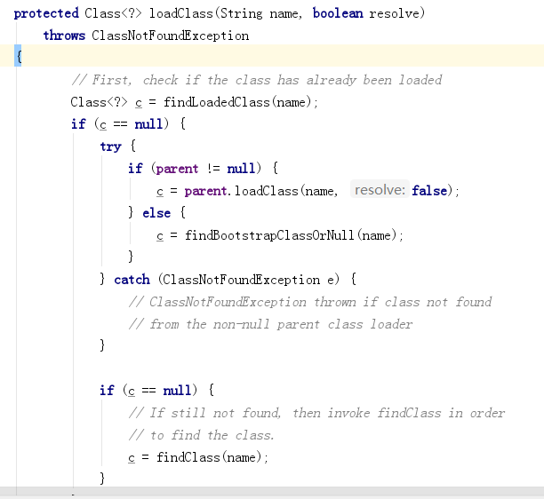
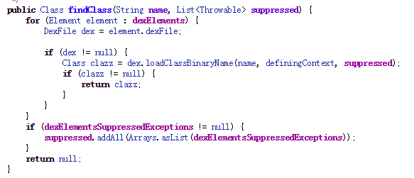

### 1、热修复原理

一般我们自己写的类都是由 `PathClassLoader` 加载的, 

类加载器在加载某个类的时候是先去父加载器那里找，

父加载器再去爷爷加载器那里找，一直往上，如果都找不到，才自己去找，

这就是java的**双亲委托机制**



通过 `ClassLoader.loadClass` 的时候会先走 `parent` 的 `loadClass`, 如果没找到会自己去找。

调用 `findClass` 方法，具体实现是在 `PathClassLoader` 的父类, 也就是 `BaseDexClassLoader` 里面。

而 `BaseDexClassLoader` 中的 `findClass` 会调用 `pathList.findClass`，代码又来到了 `DexPathList.java`



在这里可以发现，是通过遍历 `dexElements` 数组来加载类的，而 `dexElements` 是通过 `makePathElements`得到的。

如果我们把有bug的类打成一个 `dex` 包，然后通过反射放到 `dexElements` 的最前面，那不就达到修复的效果了吗。

### 2、获取补丁包
 
1. 生成 `class` 文件

```
选中app模块, 点击 Build -> Make Modules 'app'
```

2. 获取 `jar` 或者 `dex`

```
这里 --output=patch.jar 也可以是 --output=patch.dex
E:\software\AndroidStudio\SDK\build-tools\29.0.0\dx.bat --dex --output=patch.jar com/example/testhotfix/TestBug.class
```

3. 将获取到的 patch.jar 放入到自己写的路径下

```
最好放到私有目录吧，这样不用申请权限

override fun attachBaseContext(base: Context?) {
    super.attachBaseContext(base)
    FixUtil.fix(this, cacheDir.absolutePath + "/patch.jar")
}
```

### 问题:

1. 为什么java要使用双亲委托这种机制？

```
1. 避免重复查找。一个类只需要加载一次就可以了，没必要加载多次，浪费资源。
2. 避免修改系统代码。如果不用双亲委托，那么每次都要自己查找，如果自己写一个String.java，然后交给ClassLoader去加载，那么别的使用String的地方就很可能会出现问题。
```

2. `Class.forName 和 ClassLoader.loadClass 有什么区别`

```
Class.forName 不仅会加载类，还会走初始化流程。比如在类里面有静态代码块，也是会执行到的。

ClassLoader.loadClass 只是把类加载到类加载器，而不会走类的初始化流程。
```